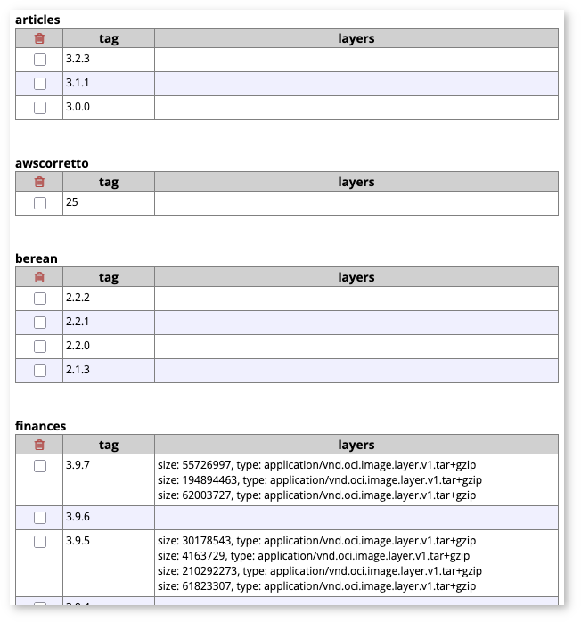

# registry-ui

### Visualizing and managing private image repositories

This application provides a web user interface which presents the contents of
a private images registry (OCI images aka Docker images). Docker Hub provides
a web UI, but its private registry offering (not to be confused with private
repositories) only provides a REST API.

In addition to displaying tags for repositories, the UI provides the
ability to delete one or more tags for a given repository.

## Design Decisions

At present, registry-ui can display all repositories and their tags, and
tags can also be deleted (multiple simultaneously allowed). Clicking on a
tag will display the layers for that tag, and each line can be clicked on
to download that layer. The download portion has not been implemented, but
it will leverage streaming rather than filling up an entire buffer and
serving the contents.

